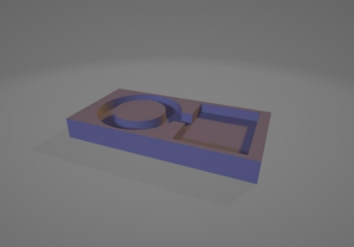
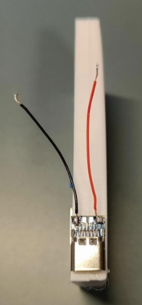

# Divera Alarm Light 

Das Divera Alarm Light lässt einen LED Ring im Alarmfall rot und blau leuchten. 

 

## Teile 

D1 Mini NodeMcu ESP8266-12F [https://amzn.to/47EQ84x ](https://amzn.to/47EQ84x)

38mm WS2812B RGB LED Ring [https://amzn.to/47FUhp2 ](https://amzn.to/47FUhp2)

USB C Buchse <https://amzn.to/48FoeH0>

## Flashen 

Laden Sie den „CH341SER“ Treiber herunter und installieren Sie diesen. Eine Anleitung finden Sie hier[ https://www.makershop.de/ch340-341-usb-installieren/  ](https://www.makershop.de/ch340-341-usb-installieren/)

Laden Sie ESPHome-Flasher herunter und führen Sie das Programm aus, eine Anleitung finden Sie hier[ https://edistechlab.com/hc-sr501-pir-motion-sensor/?v=3a52f3c22ed6 ](https://edistechlab.com/hc-sr501-pir-motion-sensor/?v=3a52f3c22ed6)

Wählen Sie den Serial Port des ESP die Sie über USB an Ihren PC anschließen. Wählen Sie die Firmware „DiveraAlarmLight.ino.d1\_mini.bin“ dieser ZIP beigefügt ist. Klicken Sie auf Flash und warten Sie bis der Vorgang abgeschlossen ist.

Für Menschen mit Programmierkenntnissen ist die INO Datei des Arduino Projektes beigefügt um Anpassungen vorzunehmen, falls gewünscht.

## Zusammenbau 

3D drucken Sie das Gehäuse und legen sich die Bauteile inkl. etwas Leitung bereit. 

Löten Sie Leitungen für Vcc, GND und Data an die Input Pins des LED Rings. 

Löten Sie die anderen Enden der Leitungen an den ESP, die Data Leitung (hier blau) wird an D2 gelötet. 

 

Kleben Sie den LED Ring mit etwas Heißkleber im Gehäuse fest. Kleben Sie außerdem die USB C Buchse an die Rechte Seite des Gehäuses. Sie können des ESP ebenfalls festkleben, wenn Sie sich sicher sind, dass alles funktioniert. Ich empfehle diesen erst einmal mit etwas Klebeband zu fixieren und auf den ersten (Probe)Alarm zu warten, bevor der ESP mit Heißkleber fixiert wird.

  

Löten Sie Leitungen für VCC und GND an die USB C Buche und verbinden Sie diese mit den VCC und GND Pins des ESP. 

 

Ihr „Divera Alarm Light“ kann nun über USB C mit Strom versorgt werden. 

## Einrichtung 

Öffnen Sie die WLAN Einstellungen Ihres Smartphones und verbinden Sie sich mit dem Netzwerk „Divera Alarm Light“. Sie sollten im Anschluss eine Benachrichtigung erhalten, um sich im Netzwerk anzumelden. 

Tippen Sie auf „Configure WiFi“, sollten sich im Feld „API Key“ undefinierbare Zeichen befinden, löschen Sie diese. 

Tippen Sie auf Ihr WLAN-Netzwerk, dieses erscheint dann im Feld „SSID“. Geben Sie ihr WLAN Passwort im Feld „Password“ ein. 

Fügen Sie Ihren Divera API Key in das Feld „API Key“ ein und tippen Sie auf „Save“. 

Sollte Ihr API Key oder WLAN Passwort fehlerhaft sein, leuchtet eine LED des Rings rot auf. Warten Sie in diesem Fall 10 Sekunden und beginnen Sie mit der Einrichtung von vorn.

Sollte keine LED leuchten und Ihr Smartphone hat sich wieder mit Ihrem Netzwerk verbunden, war die Einrichtung erfolgreich. Wenn Sie Ihr Gerät neu starten, wird eine LED des Rings kurz grün aufleuchten, sobald sich Ihr Gerät mit Ihrem WLAN Netzwerk verbunden hat.
